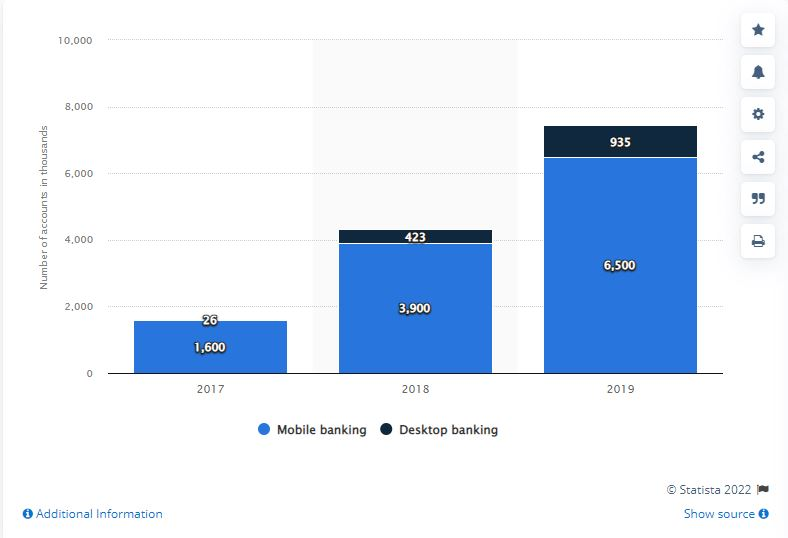

# Unit 1 Homework Assignment: FinTech Case Study

## PagSeguro
### Overview and Origin
* [PagSeguro](https://finance.yahoo.com/quote/PAGS?p=PAGS&.tsrc=fin-srch) was founded by its parent company Universo Online (UOL) in 2006 to provide the digital payment infrastructure for the burgeoning e-commerce sector of Brazil

* Between 2006-2011, 45% of Brazil's population had no bank account, and less than 30% had internet access. Yet UOL, the largest digital content, internet product and service provider in Brazil, saw the potential growth and knew that the expansion of internet users would beget a boom in the need for fast online payments

* Fastforward to 2022, and PagSeguro brings in 250 million (USD) annually in net income and offers an entire online banking ecosystem to its users. 

---
### Business Activities
* The Brazillian retail landscape contains a patchwork of micromerchants and small-to-medium sized enterprises (SMEs) -- all with highly variable needs in terms of e-commerce, many simply lack point-of-sale (POS) methods and credit card reconcilliation.

* In 2013, PagSeguro expanded their services from online payments to POS devices and mobile POS (mPOS) for individual entrepreneurs, micromerchants, and SMEs. 

* Furthermore, instead of renting out their devices for monthly fees, they allowed these small businesses to finance and buy outright the units. While this prevented recurring revenues from device rental fees, it built a moat around their customer base that has proven resilient. 

* The progression from online payments to POS, then from POS to free online banking in 2019, displays the organic and utilitarian purpose behind FinTech in many ways. They now have a single platform, PagBank, where merchants and consumers alike have access to free, scalable solutions. Onboarding requires no paperwork with a higher acceptance rate and lower fraud levels than that of prepaid card schemes.

* Merchants and the public have 37 different cash-in options on their free platform, and consumers have access to QR code payment, peer-to-peer transfers, physical cash cards, along with multiple other features. 

* For small businesses, the PagBank app can generate income reports, allow them to receive advances on card receivable accounts, and even manage inventory. 
---
### Landscape: Is there room for the jack-of-all-trades FinTech? 
* To try and box PagSeguro into a specific sector of the FinTech domain proves impossible. As of 2021, PagSeguro offers:
    1. Point-of-sale devices with NFC capability 
    2. Online payment processing for e-commerce -- not to mention their own PagMarketplace inside of their PagBank app, where merchants can offer exculsive deals to PagBank users
    3. Instant, free, unlimited wire transfers
    4. Investment accounts and investment products ranging from CDs, bonds, to even managed funds. They also pay better interest than regular savings account on deposits in accounts that have existed for over 30 days.
    5. Life, health, home, and even cell phone insurance options integrated into their PagBank app
    6. Bill payment, ATM withdraw from over 1 million ATMs across Brazil
    7. Value-added business offerings for merchants that includeearly payment of installment receivables, account reconciliation, and even shipping solutions.

All this can be accessed with a free PagBank account that requires no paperwork and can be completed in minutes. However competition abounds for the company. As a sort of jack-of-all-traits, they rely heavily on the strength of their network for growth. One could rightly count every bank across Latin America as a competitor, but two South American Fintech companies compete with PagSeguro more obviously: 

* NuBank

* StoneCo

---
1. **[NuBank](https://finance.yahoo.com/quote/NU?p=NU&.tsrc=fin-srch)** currently holds the lead in digital banking across Latin America, having just expanded into Columbia. Their user base of 30 million makes it the single largest digital non-custodial bank in Latin American, and they have 26 million users in Brazil alone. Compared to the 6 million users of PagSeguro's PagBank app, NuBank has a distinct advantage in users. However, because PagSeguro was first to market in e-commerce, total payment volume (TPV) for NuBank fallas significantly behind PagSeguro's.
    * While Nubank has only recently become available to US investors via NuHoldings, recent press releases from the company indicate there first half 2021 TPV of R$92 billion
    * Comparatively, PagSeguro brought in FY2021 TPV of R$456 billion. While Nubank has yet to release FY2021 TPV numbers, extrapolating their first half forward makes it unlikely they would have eclipsed even half of PagSeguro's TPV. Both companies saw TPV grow by nearly 100% year over year; the fact that PagSeguro dwarfs Nubank's payment volume with only *one* *fifth* of their banking client base speaks to the advantages PagSeguro has edified in e-commerce, POS, and network effects from early adoption.
---
2. **[StoneCo](https://finance.yahoo.com/quote/STNE?p=STNE&.tsrc=fin-srch)** competes with PagSeguro not on the personal banking side, but instead on payment processing and commercial lending. According to Morningstar, the Berkshire Hathaway backed fintech:
    >combines advanced, end-to-end, cloud based technology platforms; diffentiated hyper-local and integrated distribution approached; and white glove, on-demand customer service.

    * They cater primarily to small and medium sized businesses via online payment processing and POS devices for in-person transactions. PagSeguro's business offerings primarily target small entrepreneur's and micro merchants, though they do have a growing value-added (read not-free, or "white glove" as MorningStar puts it) segment. So while StonCo offers a more targeted, feature-rich business banking solution, it's also more expensive.

    * StoneCo prides itself on customer service, and has added hundreds of customer service specialists and office locations throughout Brazil. So in effect, they finteched themselves into a brick-and-mortar, niche, commercial-facing finance company. 

    * Despite beating PagSeguro in TPV, the company's market cap has shed $22 billion dollars since its peak in 2018, and recently fell 35% in a single day after net income for the quarter fell *54%* year over year. The sharp decline in profitability resulted from two components: 

        1. A complete disaster in StoneCo's credit business, as mounting bad loans have forced StoneCo to halt lending activities. 
        2. Higher borrowing costs resulting from hawkish monetary policy in Brazil 
---

### Results
Here is a quick snapshot of all three company's financial situation:
|           |PagSeguro  |NuBank     |StoneCo    |
|:----------|:----------:|:----------:|:----------:|
|*Market Cap*($K)|5,569,075|**41,014,296**|3,994,953|
|*Annual Sales*|1,322,050,000|**7,741,860,000**|644,050,000|
|*Annual Net Income*|205,580,000|**819,550,000**|165,690,000|
|*Last Quarter Sales*|**531,280,000**|334,398,000|281,290,000|
|*Last Quarter Net Income*|**61,510,000**|-34,212,000|-239,580,000|

While NuBank leads the way in volume, PagSeguro holds a distinct advantage in profitability. A huge part of that has resulted from their network effect helping to connect merchants with customers on the same network, but also by focusing and optimizing for mobile performance. 

**Number of online banking accounts in Brazil from 2017 to 2019**

(source: [Statista](https://www.statista.com/statistics/1118094/brazil-number-digital-bank-accounts/#:~:text=In%202019%2C%20the%20number%20of,in%20the%20South%20American%20country.))

According to research done by Statista and their team of over 200 data scientists, when it comes to online banking, mobile reigns supreme:
    >In 2019, the number of online banking accounts reported in Brazil amounted to nearly 7.5 million, out of which more than 87 percent were opened through mobile banking. Meanwhile, desktop banking registered a total of 935 thousand accounts in the South American country.

PagSeguro's footprint can be seen already, as consumer trends point more toward mobile banking as the preferred choice among mobile users. Brazil has more physical bank branches than any other nation in South America, and while legacy financial institutions maintain the majority of deposits in the country, FinTech -- primarily NuBank and PagSeguro -- are quickly threatening the custodial banking industries traditional role. The primary headwind for their stock (which in turn affects credit facilities, fund raising ability, and acquisition capacity) is actually something very simple: the Brazilian Real. 

1. Here is a chart showing PagSeguro and StoneCo's stock performance. NuHoldings has been included as well, though they have only recently gone public:

(source:[Yahoo Finance](https://finance.yahoo.com/quote/PAGS/chart?p=PAGS#eyJpbnRlcnZhbCI6ImRheSIsInBlcmlvZGljaXR5IjoxLCJ0aW1lVW5pdCI6bnVsbCwiY2FuZGxlV2lkdGgiOjIuMDEyNDExMzQ3NTE3NzMwMywiZmxpcHBlZCI6ZmFsc2UsInZvbHVtZVVuZGVybGF5Ijp0cnVlLCJhZGoiOnRydWUsImNyb3NzaGFpciI6dHJ1ZSwiY2hhcnRUeXBlIjoibGluZSIsImV4dGVuZGVkIjpmYWxzZSwibWFya2V0U2Vzc2lvbnMiOnt9LCJhZ2dyZWdhdGlvblR5cGUiOiJvaGxjIiwiY2hhcnRTY2FsZSI6InBlcmNlbnQiLCJwYW5lbHMiOnsiY2hhcnQiOnsicGVyY2VudCI6MSwiZGlzcGxheSI6IlBBR1MiLCJjaGFydE5hbWUiOiJjaGFydCIsImluZGV4IjowLCJ5QXhpcyI6eyJuYW1lIjoiY2hhcnQiLCJwb3NpdGlvbiI6bnVsbH0sInlheGlzTEhTIjpbXSwieWF4aXNSSFMiOlsiY2hhcnQiLCLigIx2b2wgdW5kcuKAjCJdfX0sInNldFNwYW4iOm51bGwsImxpbmVXaWR0aCI6Miwic3RyaXBlZEJhY2tncm91bmQiOnRydWUsImV2ZW50cyI6dHJ1ZSwiY29sb3IiOiIjMDBiMDYxIiwic3RyaXBlZEJhY2tncm91ZCI6dHJ1ZSwicmFuZ2UiOm51bGwsImV2ZW50TWFwIjp7ImNvcnBvcmF0ZSI6W10sInNpZ0RldiI6e319LCJzeW1ib2xzIjpbeyJzeW1ib2wiOiJQQUdTIiwic3ltYm9sT2JqZWN0Ijp7InN5bWJvbCI6IlBBR1MiLCJxdW90ZVR5cGUiOiJFUVVJVFkiLCJleGNoYW5nZVRpbWVab25lIjoiQW1lcmljYS9OZXdfWW9yayJ9LCJwZXJpb2RpY2l0eSI6MSwiaW50ZXJ2YWwiOiJkYXkiLCJ0aW1lVW5pdCI6bnVsbCwic2V0U3BhbiI6bnVsbH0seyJzeW1ib2wiOiJTVE5FIiwic3ltYm9sT2JqZWN0Ijp7InN5bWJvbCI6IlNUTkUifSwicGVyaW9kaWNpdHkiOjEsImludGVydmFsIjoiZGF5IiwidGltZVVuaXQiOm51bGwsInNldFNwYW4iOm51bGwsImlkIjoiU1RORSIsInBhcmFtZXRlcnMiOnsiY29sb3IiOiIjNjUwMGU4Iiwid2lkdGgiOjIsImlzQ29tcGFyaXNvbiI6dHJ1ZSwic2hhcmVZQXhpcyI6dHJ1ZSwiY2hhcnROYW1lIjoiY2hhcnQiLCJzeW1ib2xPYmplY3QiOnsic3ltYm9sIjoiU1RORSJ9LCJwYW5lbCI6ImNoYXJ0IiwiZmlsbEdhcHMiOmZhbHNlLCJhY3Rpb24iOiJhZGQtc2VyaWVzIiwic3ltYm9sIjoiU1RORSIsImdhcERpc3BsYXlTdHlsZSI6InRyYW5zcGFyZW50IiwibmFtZSI6IlNUTkUiLCJvdmVyQ2hhcnQiOnRydWUsInVzZUNoYXJ0TGVnZW5kIjp0cnVlLCJoZWlnaHRQZXJjZW50YWdlIjowLjcsIm9wYWNpdHkiOjEsImhpZ2hsaWdodGFibGUiOnRydWUsInR5cGUiOiJsaW5lIiwic3R5bGUiOiJzdHhfbGluZV9jaGFydCIsImhpZ2hsaWdodCI6ZmFsc2V9fSx7InN5bWJvbCI6Ik5VIiwic3ltYm9sT2JqZWN0Ijp7InN5bWJvbCI6Ik5VIn0sInBlcmlvZGljaXR5IjoxLCJpbnRlcnZhbCI6ImRheSIsInRpbWVVbml0IjpudWxsLCJzZXRTcGFuIjpudWxsLCJpZCI6Ik5VIiwicGFyYW1ldGVycyI6eyJjb2xvciI6IiM3MmQzZmYiLCJ3aWR0aCI6MiwiaXNDb21wYXJpc29uIjp0cnVlLCJzaGFyZVlBeGlzIjp0cnVlLCJjaGFydE5hbWUiOiJjaGFydCIsInN5bWJvbE9iamVjdCI6eyJzeW1ib2wiOiJOVSJ9LCJwYW5lbCI6ImNoYXJ0IiwiZmlsbEdhcHMiOmZhbHNlLCJhY3Rpb24iOiJhZGQtc2VyaWVzIiwic3ltYm9sIjoiTlUiLCJnYXBEaXNwbGF5U3R5bGUiOiJ0cmFuc3BhcmVudCIsIm5hbWUiOiJOVSIsIm92ZXJDaGFydCI6dHJ1ZSwidXNlQ2hhcnRMZWdlbmQiOnRydWUsImhlaWdodFBlcmNlbnRhZ2UiOjAuNywib3BhY2l0eSI6MSwiaGlnaGxpZ2h0YWJsZSI6dHJ1ZSwidHlwZSI6ImxpbmUiLCJzdHlsZSI6InN0eF9saW5lX2NoYXJ0IiwiaGlnaGxpZ2h0IjpmYWxzZX19XSwiY3VzdG9tUmFuZ2UiOm51bGwsIndpZHRoIjoyLCJzdHVkaWVzIjp7IuKAjHZvbCB1bmRy4oCMIjp7InR5cGUiOiJ2b2wgdW5kciIsImlucHV0cyI6eyJpZCI6IuKAjHZvbCB1bmRy4oCMIiwiZGlzcGxheSI6IuKAjHZvbCB1bmRy4oCMIn0sIm91dHB1dHMiOnsiVXAgVm9sdW1lIjoiIzAwYjA2MSIsIkRvd24gVm9sdW1lIjoiI2ZmMzMzYSJ9LCJwYW5lbCI6ImNoYXJ0IiwicGFyYW1ldGVycyI6eyJ3aWR0aEZhY3RvciI6MC40NSwiY2hhcnROYW1lIjoiY2hhcnQiLCJwYW5lbE5hbWUiOiJjaGFydCJ9fX19) )
